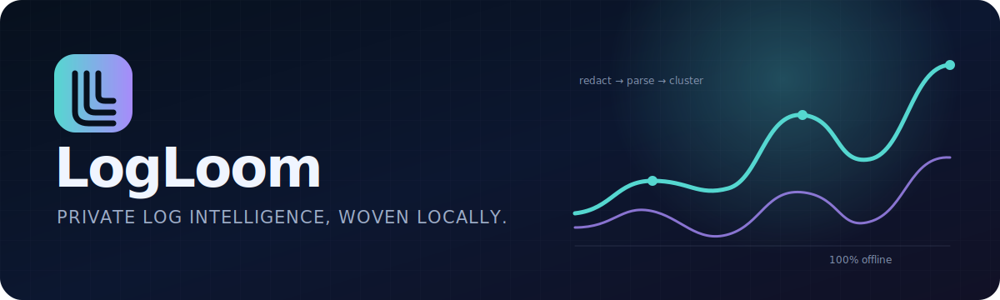

<div align="center">
  

  <p><strong>Turn messy production logs into an investigation you can search, share, and act on — without uploading a byte.</strong></p>

  <p>
    <a href="https://github.com/mockingbird777/logloom/actions/workflows/ci.yml"></a>
    
    
    
    
  </p>
</div>

LogLoom is a privacy-first, local-first CLI for the first 15 minutes of a log investigation. It streams NDJSON, logfmt, and familiar plain-text logs; removes likely secrets and personal data; discovers repeating message templates; surfaces bursts and latency regressions; and produces a polished, self-contained HTML report.

The report makes **no network requests**. Email it, attach it to an incident, or keep it beside your logs: the data and the investigation remain yours.

<p align="center"><a href="https://mockingbird777.github.io/logloom/"><strong>Explore a live private-by-default investigation report →</strong></a></p>

## Why LogLoom?

You should not need to provision a data pipeline just to answer “what changed?” — and sensitive logs should not have to leave your machine.

| Raw question | LogLoom answer |
|---|---|
| Which failures dominate? | Drain-like templates ranked by count and error volume |
| Did errors arrive gradually or all at once? | Time buckets with robust burst detection |
| Is the service slower? | Exact or bounded-memory p50, p95, and p99 latency |
| Which service/level is noisy? | Level, service, and template breakdowns |
| Can I share the result safely? | Default-on secret, token, email, and IP redaction |
| Do I need a backend? | No — one Node.js process and one portable HTML file |

## Quick start

Requires Node.js 20 or newer.

Until the first npm registry release, run LogLoom directly from its public GitHub repository. The package's `prepare` hook performs the TypeScript build during installation.

```bash
# Analyze a file and open the resulting report in your browser
npx --yes github:mockingbird777/logloom analyze ./app.log --html ./logloom-report.html

# Stream from another command
kubectl logs deployment/payments --since=30m \
  | npx --yes github:mockingbird777/logloom analyze --html incident.html --json incident.json

# Works with gzipped files too
npx --yes github:mockingbird777/logloom analyze archived.jsonl.gz --html archive.html
```

To run the repository version:

```bash
git clone https://github.com/mockingbird777/logloom.git
cd logloom
npm install
npm run build
node dist/cli.js examples/sample.log --html report.html
```

The terminal also gives a fast summary:

```text
LogLoom 0.1.0  examples/sample.log
────────────────────────────────────────────────────────────────────────
6 events  ·  3 errors (50%)  ·  4 templates
2 services  ·  0 anomalies  ·  3 redactions
Latency  p50 520ms  ·  p95 1.2s  ·  p99 1.2s
```

## What you get

- **Streaming ingestion** from a file, `.gz`, or stdin with byte-bounded line handling; LogLoom never needs to load the raw file into memory, even for an oversized line.
- **Format auto-detection per line** for JSONL/NDJSON, logfmt, ISO/syslog-style plain text, and mixed files.
- **Safe-by-default redaction** of JWTs, bearer tokens, GitHub tokens, AWS access keys, embedded secrets, emails, IPv4 addresses, common absolute filesystem paths, private keys, and sensitive structured fields.
- **Drain-like template mining** that turns `request 9217 failed` and `request 9341 failed` into `request <num> failed`.
- **Anomaly signals** for error bursts, template-frequency spikes, and p95 latency regressions using median/MAD baselines with a variance-aware fallback.
- **Latency p50/p95/p99** from common `duration`, `latency`, `elapsed`, and `response_time` fields with `ns`, `µs`, `ms`, and `s` unit support.
- **Portable interactive HTML** with overview cards, timeline visualization, anomaly summaries, template samples, search, filters, sorting, and JSON export.
- **Stable JSON output** for scripts and CI, plus meaningful exit codes for anomaly gates.
- **Zero runtime dependencies** and no telemetry, accounts, cookies, databases, or remote APIs.

## CLI reference

```text
logloom analyze [file|-] [options]

--html <path>              write a self-contained HTML report
--json <path>              write JSON (use - for stdout)
--format summary|json|html print a format to stdout
--bucket <duration>        time bucket: 30s, 1m, 5m (default 1m)
--top <number>             templates in the terminal summary (default 10)
--max-line-length <size>   truncate oversized lines (default 2mb)
--no-redact                turn redaction off — share output with care
--redaction-config <path>  add sensitive fields and regex patterns
--fail-on-anomaly          exit 1 when at least one anomaly is found
-q, --quiet                suppress summary and write notices
```

Exit codes are deliberately automation-friendly:

| Code | Meaning |
|---:|---|
| `0` | Analysis completed successfully |
| `1` | Analysis completed and `--fail-on-anomaly` matched |
| `2` | Invalid arguments, unreadable input, or analysis failure |

## Supported input

LogLoom detects the format of every non-empty line, so migrations and concatenated files are fine.

```json
{"timestamp":"2026-07-19T08:00:01Z","level":"error","service":"checkout","message":"gateway timeout","duration_ms":920}
```

```text
time=2026-07-19T08:00:01Z level=error service=checkout duration=920ms msg="gateway timeout"
2026-07-19T08:00:01Z ERROR [checkout] gateway timeout duration=920ms
Jul 19 08:00:01 WARN [worker] retrying job 812
```

Recognized aliases include `time`, `ts`, and `@timestamp`; `level` and `severity`; `message`, `msg`, and `event`; `service`, `app`, and `component`; plus the common duration fields listed above. Numeric Pino-style levels are normalized too.

## Privacy model

Redaction happens **immediately after parsing and before clustering, sampling, aggregation, or report generation**. Raw files are processed transiently and are never copied into a report. Each template retains at most three already-redacted message samples, capped at 500 characters each.

Default replacements are explicit (`[REDACTED:EMAIL]`, `[REDACTED:IP]`, and so on), so you can still understand the shape of a message. Structured fields such as `password`, `authorization`, `cookie`, `access_token`, and `client_secret` are replaced as a whole.

Add organization-specific fields and patterns with a small JSON file:

```json
{
  "sensitiveFields": ["customer_id", "tenant_slug"],
  "patterns": [
    { "name": "ORDER_ID", "regex": "\\bORD-[A-Z0-9]{8}\\b", "flags": "gi" }
  ]
}
```

```bash
logloom analyze app.log \
  --redaction-config examples/redaction.config.json \
  --html report.html
```

> [!IMPORTANT]
> Heuristic redaction reduces accidental exposure; it cannot prove that output is anonymous. Review reports before sharing them outside your trust boundary. `--no-redact` is intentionally conspicuous in report metadata.

## How the analysis works

### Template mining

Messages are tokenized and high-cardinality values (numbers, UUIDs, URLs, hashes, paths, and redaction markers) are normalized. Candidates are partitioned by token count, then matched by positional similarity. A match at or above `0.60` updates differing positions to `<*>`; otherwise a new stable template is created. This is a compact, streaming-friendly adaptation of the ideas behind Drain rather than a byte-for-byte implementation.

### Anomaly detection

For each populated time bucket, LogLoom compares error count and p95 latency with at least three other populated baseline buckets using the median and median absolute deviation (MAD). When MAD is zero, a square-root variance scale avoids dividing by zero. Template frequency is tested across the same bucket axis. Minimum count and ratio gates suppress tiny-number alerts; the score and baseline remain in JSON so humans can audit every signal.

Anomalies are clues, not verdicts. Sparse timelines are called out in report notes.

### Quantiles and memory

Up to 50,000 latency values are retained for exact quantiles. Larger inputs use a deterministic fixed-size reservoir, clearly marked as approximate. Per-bucket latency samples are bounded separately. Raw input remains streaming; aggregate memory grows with unique templates, services, and populated buckets rather than file size.

## JSON and library API

The report uses schema version `1.0` and contains metadata, summary statistics, formats, levels, services, templates, timeline buckets, anomalies, privacy counters, and analysis notes.

```bash
logloom analyze app.jsonl --format json \
  | jq '.templates[:5] | map({template, count, errors})'
```

LogLoom can also be embedded:

```ts
import { analyzeLines, renderHtmlReport } from 'logloom';

async function* lines() {
  yield '{"level":"info","message":"ready","service":"api"}';
}

const report = await analyzeLines(lines(), { bucketMs: 60_000 });
const html = renderHtmlReport(report);
```

## Development

```bash
npm install
npm test                 # compile + Node's built-in test runner
npm run test:coverage
npm run check            # tests + package dry run
```

The repository intentionally keeps the stack small: strict TypeScript, Node.js built-ins, no runtime packages, and fixtures that exercise mixed formats and sensitive values.

## Limitations

- Multiline stack traces are currently treated as individual lines. A future multiline joiner will make this configurable.
- IPv6 textual addresses are not redacted in `0.1.0`; use a custom pattern when needed.
- Time buckets are populated only where events exist; the chart does not synthesize empty buckets.
- Template mining favors bounded cost and explainability over semantic similarity.
- Extremely high-cardinality services or templates still consume aggregate memory.

## Roadmap

- [ ] Configurable multiline/stack-trace joining
- [ ] Compare two reports to explain a deployment regression
- [ ] Streaming OpenTelemetry log JSON support
- [ ] Pluggable template and redaction rules
- [ ] Flame-style latency distribution view
- [ ] Optional WASM build for fully local browser analysis

## Contributing and security

Bug reports, new fixtures, parser improvements, and careful false-positive reductions are welcome. Read [CONTRIBUTING.md](CONTRIBUTING.md) and the [Code of Conduct](CODE_OF_CONDUCT.md) before opening a pull request.

Logs often contain credentials. Please report vulnerabilities through the private process in [SECURITY.md](SECURITY.md), not a public issue.

## License

MIT © 2026 LogLoom contributors. See [LICENSE](LICENSE).
